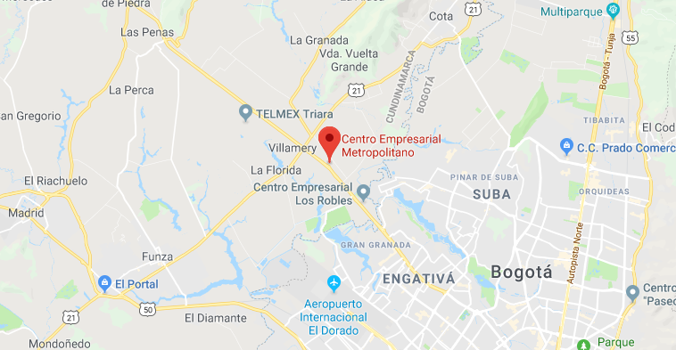
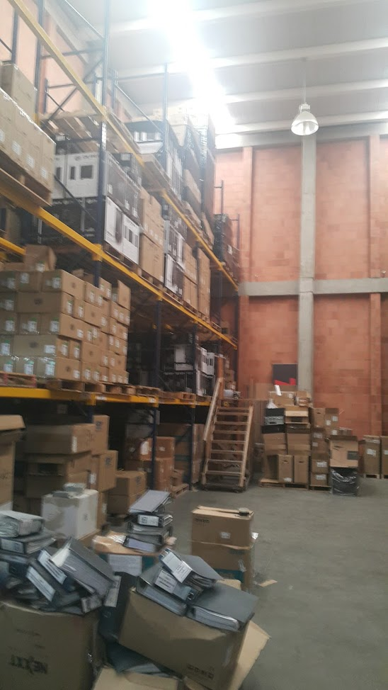
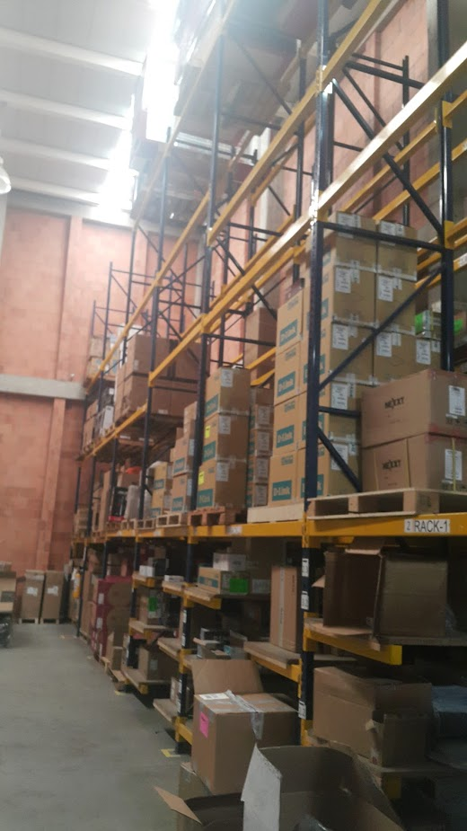

# Análisis de requerimientos 

El siguiente vídeo ilustra el entorno ideal del prototipo del proyecto, se apoya en una versión del dispositivo smartglass posterior a la EPSON-BT300 (Epson Moverio Pro BT-2000). El objetivo ideal del sistema es apoyar el proceso "picking" en una bodega de gran tamaño, eliminando el uso de formatos en papel durante su funcionamiento.

El proyecto actual busca realizar un proceso de investigación que identifique las tecnologías más adecuadas para lograr un sistema como el mostrado en el vídeo, generando:
* la identificación del *stack* de tecnologías adecuadas, por el contexto del SENA y OpenSAI, dichas tecnologías deben permitir la apropiación del conocimiento asociado a su uso, no restringir su acceso con modelos de licenciamiento no escalables, ser de fácil acceso y con requerimientos de funcionamiento cercanos a nuestro entorno, sin perjudicar la calidad de los artefactos de ingeniería generados
* identificar el estado del arte de este tipo de soluciones y su pertinencia para el mercado nacional, con una posible proyección fuera de Colombia
* generar un proceso de transferencia de conocimiento que permita ofrecer una aproximación a las tecnologías identificadas en la investigación
* generar una versión funcional de un prototipo, de libre acceso para reutilización en procesos de innovación futuros o simplemente para validar la NO viabilidad de dicha linea de investigación aplicadidentificar el estado del arte de este tipo de soluciones y su pertinencia para el mercado nacional, con una posible proyección fuera de Colombia
* generar un proceso de transferencia de conocimiento que permita ofrecer una aproximación a las tecnologías identificadas en la investigación
* generar una versión funcional de un prototipo, de libre acceso para reutilización en procesos de innovación futuros o simplemente para validar la NO viabilidad de dicha linea de investigación aplicada

## Validación con el sector productivo 

A nivel contractual es recomendable incluir una articulación efectiva del presente esfuerzo de investigación aplicada, con un entorno productivo real, de la industria local, para entre otras cosas retroalimentar la iniciativa y cumplir el requisito de aplicabilidad y pertinencia de la misma.

[Ubicación del espacio de validación del prototipo:](https://www.google.com/maps/place/Centro+Empresarial+Metropolitano/@4.7350651,-74.2012662,12z/data=!4m5!3m4!1s0x8e3f839f3fec548f:0x7e52983f32c1a9c0!8m2!3d4.7521159!4d-74.1460096)

Bodega:

## Difusión fuera del entorno académico del Centro de Gestión de Mercados, Logística y Tecnologías de la Investigación - CGMLTI 

Como una aproximación inicial, se ha compartido parte del esfuerzo realizado en la presente iniciativa con comunidades académicas externas al SENA, que se encuentran articuladas al Ecosistema OpenSAI, en específico con la Universidad Minuto de Dios - UNIMINUTO - Villavicencio, gracias al convenio suscrito con ellos. 

**La anterior exposición debe ser revalidada en otros espacios y comunidades**, se tiene proyectado presentar el presente trabajo durante el 2018 en:
* Semana de la Ingeniería - Universidad Distrital Francisco José de Caldas
* Ponencia oficial en REDCOLSI 
* Presentación oficial en la Red UxTIC

participaciones sujetas a disponibilidad de agenda y avances del proyecto.
