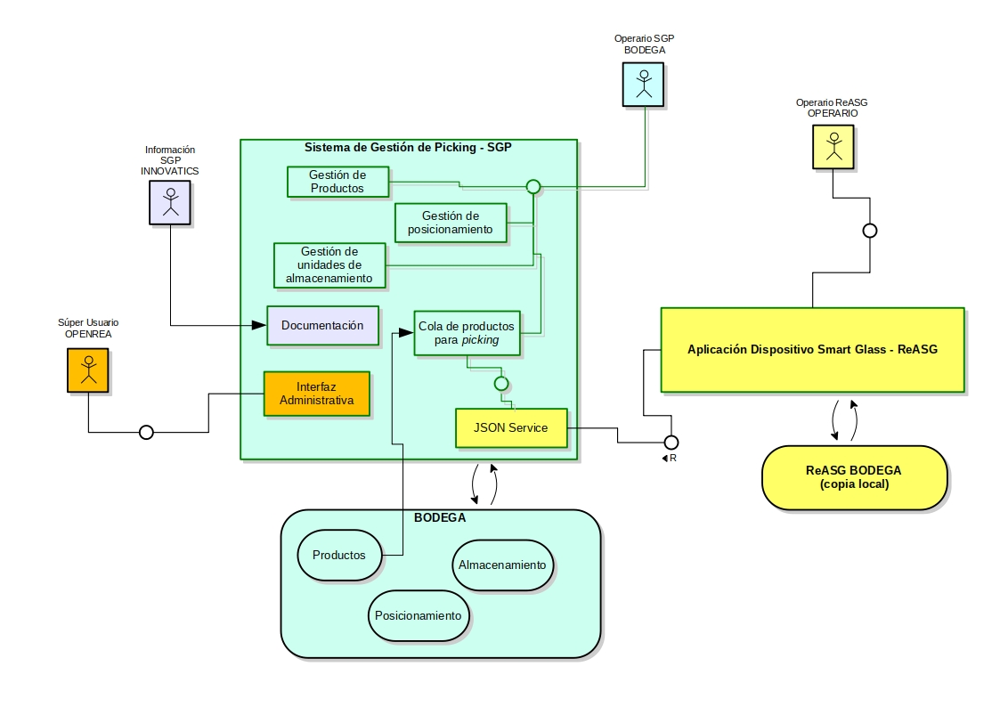
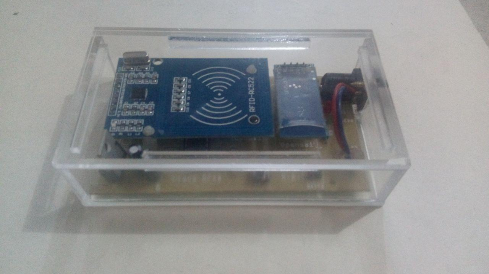
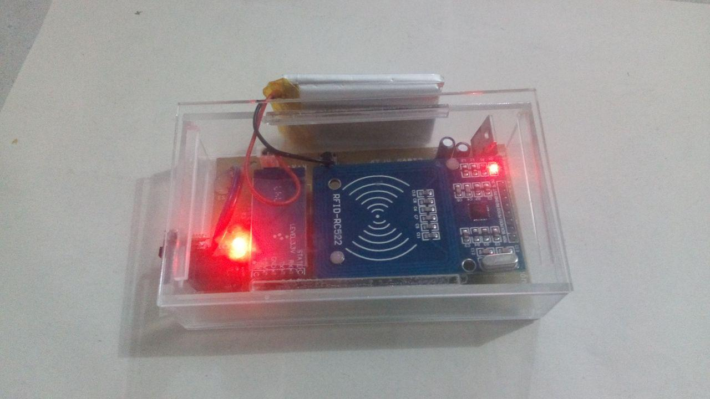
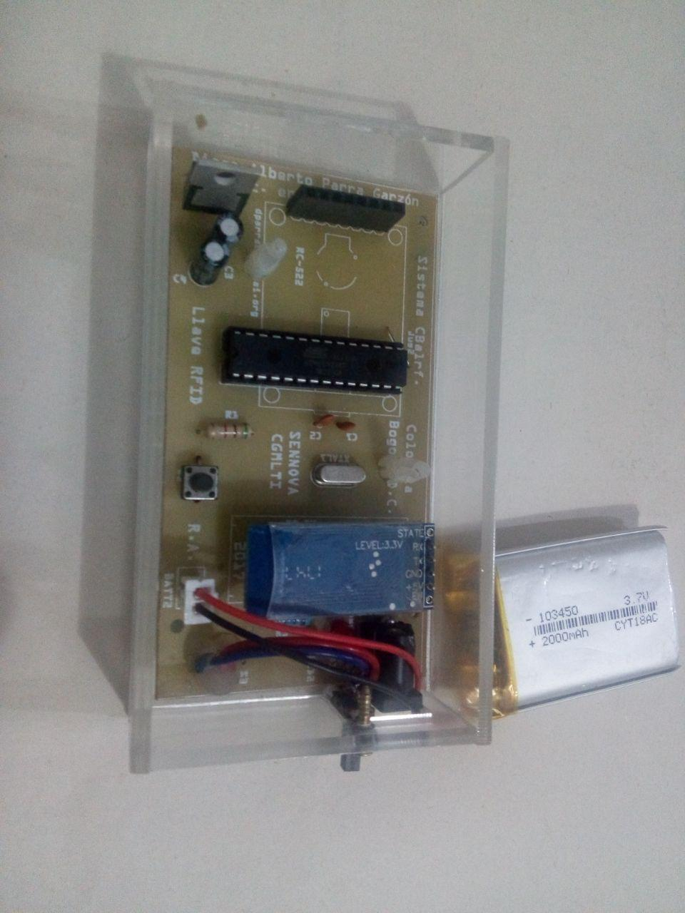

# Diseño de prototipo 

La versión final del prototipo tiene dos componentes principales: Sistema de Gestión de Picking y la Aplicación en el Dispositivo Smart Glass.
## Sistema de Gestión de Picking - SGP
Es un aplicativo que está configurado para funcionar en la web, bajo un entorno LAMP (Linux - Apache - MariaDB - PHP). Funciona sobre un sistema administrador de contenidos (Joomla CMS), que tiene una arquitectura MVC (Modelo Vista Controlador).

La gestión del modelo de datos asociado, se ha realizado con Fabrik, un Kit de Construcción de Contenido (CCK - por sus siglas en inglés) que se integra al CMS mencionado como un componente adicional. Este CCK permite desde una interfaz web, crear las tablas, consultas y vistas requeridas para el Sistema de Gestión de Picking y ha sido seleccionado por su versatilidad, facilidad que ofrece para validar la prueba de concepto asociada al prototipo del proyecto.

### Roles
* INNOVATICS (Información SGP): es un perfil de presentación de información en la instancia actual del Sistema de Gestión de Picking, su objetivo es ofrecer un consolidado oficial de la documentación más relevante para el proyecto (usuario: innovatics, contraseña: @20innovatics18).
* BODEGA (Operario SGP): es el perfil operativo del sistema, su objetivo es ofrecer una interfaz de uso del sistema a un operario de bodega encargado del alistamiento de pedidos, tarea que utiliza para su ejecución un proceso de picking de productos en bodega (usuario: bodega, contraseña: @20bodega18).
* OPENREA (Super Usuario SGP): es un perfil administrativo del Sistema de Gestión de Picking, tiene asignado el acceso de Super-Usuario del CMS sobre el que funciona el sistema. Puede crear nuevos usuarios, configurar los existentes, administrar los contenidos asociados a la documentación, enlaces del sistema, actualización del mismo, gestionar las consultas y tablas de productos/almacenamiento/coordenadas, puede configurar y administrar el sistema en general (usuario: openrea, contraseña: 20OpenRe@18).
### Lógica de funcionamiento (Rol Usuario Bodega)
1. El usuario accede desde su estación de trabajo al servidor donde se encuentra el Sistema de Gestión de Picking funcionando
Utiliza sus credenciales para autenticarse frente a dicho sistema
1. Una vez autenticado, el sistema ofrece cuatro enlaces desde su menú superior principal, cada una con funcionalidades específicas:
  1. Productos: básicamente es el listado de productos de inventario disponible en bodega, permite agregar/editar productos y seleccionarlos para la cola de alistamiento en el proceso de picking. El usuario administrador del sistema OPENREA puede desde la interfaz administrativa de Fabrik realizar una carga desde un archivo plano tipo CSV en un proceso por lotes, de un posible inventario general en bodega. El archivo CSV utilizado debe estar configurado según los datos de las tablas existentes.
  1. Alistamiento: presenta la cola de alistamiento de productos que deben ser recogidos en la bodega por el operario que utiliza las smart glass. Permite cancelar un producto de la cola en cuestión si así se requiere. Cuando el operario recoge en bodega el producto seleccionado, el dispositivo smart glass se comunica con el Sistema de Gestión de Picking para descargarlo de la cola de alistamiento de productos.
  1. Almacenamiento: es un listado de depositos en bodega para asociarse a productos en específico (por ejemplo: teclados, portátiles, monitores, etc.), o a un código de bodegaje. Permite agregar/editar los depositos disponibles.
  1. Posicionamiento: es un registro de coordenadas en bodega a las cuales se les asocia un serial que será mapeado desde un código de posicionamiento que utiliza la Aplicación del Dispositivo Smart Glass para ubicarse en bodega. Es un requisito del todo el sistema que el espacio físico de la bodega se etiquete con dichos códigos de posicionamiento, ya que se leerán automáticamente para actualizar la posición del operario que busca el producto desde los depositos y la posición objetivo del mismo en bodega.

Los dos últimos ítems se utilizarían durante la configuración del sistema para un entorno específico de la bodega, los dos primeros ofrecen las funcionalidades operativas del proceso de picking.

### Modelo de Datos
#### Productos

Describe a un producto del inventario de la bodega.
<table style="border-width: thin; border-color: #e6e6fa; margin-left: auto; margin-right: auto;" rules="rows">

<tbody>

<tr>

<td style="background-color: #a9a9a9; text-align: center; vertical-align: middle;">Nombre</td>

<td style="background-color: #a9a9a9; text-align: center; vertical-align: middle;">Etiqueta</td>

<td style="background-color: #a9a9a9; text-align: center; vertical-align: middle;">Descripción</td>

</tr>

<tr>

<td>id</td>

<td>id</td>

<td>Identificador del registro en base de datos</td>

</tr>

<tr>

<td>date_time</td>

<td>date_time</td>

<td>Marca de tiempo de creación del registro en base de datos</td>

</tr>

<tr>

<td>serial</td>

<td>Serial ID</td>

<td>Identificador alfanumérico del producto</td>

</tr>

<tr>

<td>image</td>

<td>Imagen Referencia</td>

<td>Imagen de referencia del producto</td>

</tr>

<tr>

<td>product</td>

<td>Producto</td>

<td>Nombre del producto</td>

</tr>

<tr>

<td>detalles</td>

<td>Descripción</td>

<td>Descripción del mismo</td>

</tr>

<tr>

<td>location</td>

<td>Ubicación Bodega</td>

<td>El serial del deposito en bodega donde se encuentra el producto</td>

</tr>

<tr>

<td>picking</td>

<td>Alistamiento</td>

<td>¿Es requerido para alistamiento? (si/no)</td>

</tr>

</tbody>

</table>

#### Almacenamiento

Describe un deposito particular en bodega, este depósito se asociaría a un producto en particular del inventario.

<table style="border-width: thin; border-color: #e6e6fa; margin-left: auto; margin-right: auto;" rules="rows">

<tbody>

<tr>

<td style="background-color: #a9a9a9; text-align: center; vertical-align: middle;">Nombre</td>

<td style="background-color: #a9a9a9; text-align: center; vertical-align: middle;">Etiqueta</td>

<td style="background-color: #a9a9a9; text-align: center; vertical-align: middle;">Descripción</td>

</tr>

<tr>

<td>id</td>

<td>id</td>

<td>Identificador del registro en base de datos</td>

</tr>

<tr>

<td>date_time</td>

<td>date_time</td>

<td>Marca de tiempo de creación del registro en base de datos</td>

</tr>

<tr>

<td>serial</td>

<td>Serial</td>

<td>Identificador alfanumérico del depósito en bodega</td>

</tr>

<tr>

<td>position_name</td>

<td>Nombre</td>

<td>Nombre del depósito en bodega</td>

</tr>

<tr>

<td>position_details</td>

<td>Descripción</td>

<td>Descripción del depósito en bodega</td>

</tr>

<tr>

<td>location</td>

<td>Localización</td>

<td>Serial de la coordenada en bodega asociada a este depósito en particular</td>

</tr>

</tbody>

</table>

#### Posicionamiento
Describe una coordenada particular en bodega, esta coordenada se asocia a un depósito en particular.

<table style="border-width: thin; border-color: #e6e6fa; margin-left: auto; margin-right: auto;" rules="rows">

<tbody>

<tr>

<td style="background-color: #a9a9a9; text-align: center; vertical-align: middle;">Nombre</td>

<td style="background-color: #a9a9a9; text-align: center; vertical-align: middle;">Etiqueta</td>

<td style="background-color: #a9a9a9; text-align: center; vertical-align: middle;">Descripción</td>

</tr>

<tr>

<td>id</td>

<td>id</td>

<td>Identificador del registro en base de datos</td>

</tr>

<tr>

<td>date_time</td>

<td>date_time</td>

<td>Marca de tiempo de creación del registro en base de datos</td>

</tr>

<tr>

<td>serial</td>

<td>Serial</td>

<td>Identificador alfanúmerico de la coordenada en bodega</td>

</tr>

<tr>

<td>physical_location_X</td>

<td>Coordenada Física Ancho (metros)[X]</td>

<td>Coordenada X</td>

</tr>

<tr>

<td>physical_location_Y</td>

<td>Coordenada Física Largo (metros)[Y]</td>

<td>Coordenada Y</td>

</tr>

</tbody>

</table>

### Aplicación Dispositivo Smart Glass - ReASG
Es una aplicación programada para el Sistema Operativo Android, que funciona sobre el dispositivo Smart Glass EPSON BT-300. La última versión de la aplicación ha sido desarrollada en el entorno Processing.

#### Flujo de trabajo de la aplicación
1. El operario enciende el dispositivo smart glass y carga la aplicación
1. La aplicación entra modo consulta de productos en espera de ser recogidos (proceso de picking)
1. Si no se encuentra ningún producto en la cola, la aplicación presentará un ícono de carro de compras en verde
1. Si se encuentran productos en cola para ser recogidos en bodega, la aplicación presentará un ícono de carro de compras en rojo, con el número de productos en espera
1. Si el operador oprime el botón principal de selección en el pad del dispositivo, la aplicación carga la información del producto a ser recogido en bodega, desde el listado de productos cargados en el Sistema de Gestión de Picking, presentando la foto del producto y sus datos básicos en pantalla
1. Si el operador oprime de nuevo el botón principal de selección en el pad del dispositivo, la aplicación entra en modo búsqueda y navegación en bodega, se presenta una interfaz en 2D, donde se ubican dos puntos, uno señalando la posición en bodega del producto a ser recogido para el alistamiento del pedido y otro señalando la posición actual del operario. Durante la navegación del operario, la cámara integrada del dispositivo lee de manera automática los códigos qr de posicionamiento en bodega, actualizando la posición del operario en el mapa de navegación.
1. Cuándo la cámara reconoce el código qr del almacenamiento asociado al producto, se detiene para confirmación por parte del operario desde el botón principal del pad del dispositivo.
1. Al operario realizar la confirmación del punto anterior, la aplicación actualiza la cola de espera en el Sistema de Gestión de Picking y vuelve al paso 2 (modo consulta), para buscar otro producto. Si la cola esta vacía presenta de nuevo el ícono del carro de compras en verde.

### Roles
1. OPERARIO (Operario Picking ReASG): es el operario encargado en bodega de la búsqueda en bodega de los productos para el alistamiento de los pedidos, utiliza por lo tanto la aplicación el dispositivo smart glass para guiarse en dicha tarea.

### Dispositivo complementario de autenticación (asociado al contenido pedagógico)
Es un sistema básico de autenticación compuesto de un módulo de hardware y una aplicación para el dispositivo smart glass. Es una implementación de un dispositivo tipo IoT, descrito en los contenidos pedagógicos generados en la ejecución del proyecto. Tiene como objetivo ilustrar el uso del entorno de desarrollo de Python Kivy, junto con la fabricación y programación de un dispositivo de hardware autónomo, que se conecta e interactúa con el dispositivo smart glass.

#### Operación
##### Prerequisitos:
1. Se debe encender el dispositivo de hardware complementario y configurar su conexión automática al dispositivo smart glass
1. Se debe configurar el dispositivo smart glass para que arranque de manera automática la aplicación desarrollada en Kivy.
1. Se debe configurar la Aplicación dispositivo Smart Glass, para que verifique la existencia del archivo de bloqueo generado por el Dispositivo complementario de autenticación.

#### Operación:
* Utilizando una tarjeta de proximidad, el operario en bodega se autentica frente al dispositivo smart glass (internamente la aplicación genera un archivo de bloqueo que será utilizado para validar la sesión desde la Aplicación dispositivo Smart Glass descrita anteriormente)
* Al iniciar la Aplicación dispositivo Smart Glass, si la autenticación con tarjeta fué exitosa funcionará normalmente, en caso contrario solicitará su autenticación por tarjeta.

La aplicación permite desde su utilidad de configuración, registrar tarjetas o borrarlas del registro de autenticación.

> Se reitera que se ofrece este dispositivo a modo ilustrativo, como insumo de trabajo futuro para extender la funcionalidad del prototipo de picking, y su implementación, pruebas e integración requiere una etapa posterior de trabajo.
